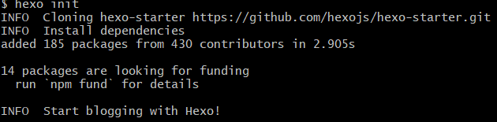
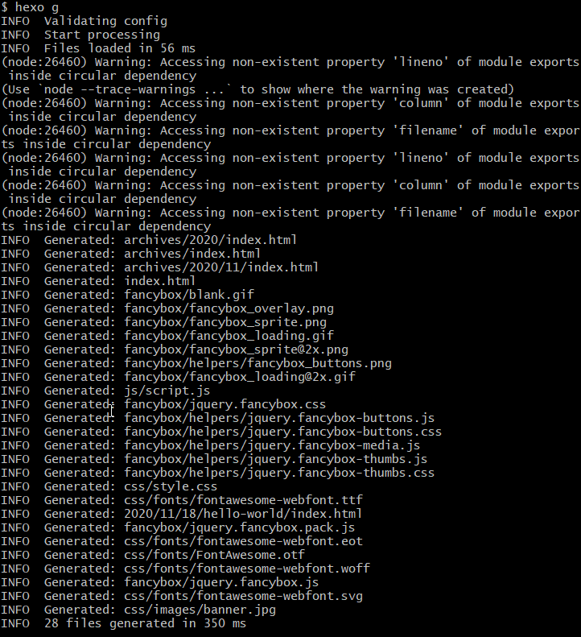
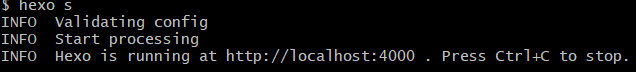
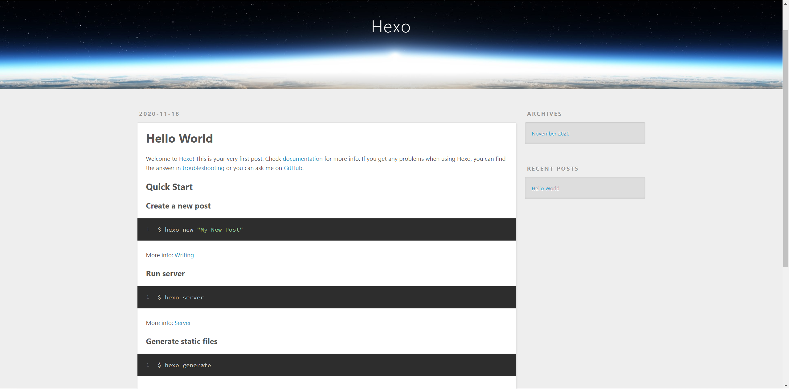
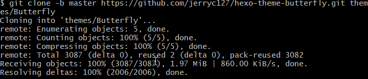

# 使用 hexo+Github 部署自己的博客

### :four_leaf_clover:hexo简介
- hexo是一个简单、快速、强大的博客发布工具，支持Markdown格式，有众多优秀插件和主题
- 

#### :grey_question:如何部署
>- 一些参考的视频链接—— [:sheep: CodeSheep](https://www.bilibili.com/video/BV1Yb411a7ty?from=search&seid=13978613241890990487)和[:video_camera: Master_lisa](https://www.bilibili.com/video/BV1A4411G7SF?p=2)


**:herb: 安装nodejs**
  - nodejs下载
    - **[win](https://nodejs.org/en/download/)**
    - **[linux](https://nodejs.org/en/download/)**

**:cactus: 安装Git**
  - **Windows** **[下载和安装Git](https://gitforwindows.org/)**
  - **Linux**安装Git **`sudo apt-get install git`**
    - 安装之后进行**Git**配置
      - 配置用户名 **`git config --global user.name "用户名"`**
      - 配置邮箱地址 **`git config --global user.email "你的邮箱地址"`**
      - 创建公钥 **`ssh-keygen -t rsa -C "youremail@example.com"`** 会在用户目录 **`~/.ssh`** 下创建有 **`id_rsa`** 和 **`id_rsa.pub`** 两个文件
        - Windows下则在 **`C:\user\xxx\.ssh`** 目录下
      - 导入公钥 登录[Github](https://github.com/)，进入设置 **settings -> SSH and GPG keys -> New SSH key** 创建一个SSH key—— **`Title`** 可以随意填，**`Key`** 中填 **`id_rsa.pub`** 中的内容，点击创建，公钥就导入完成
  
**:palm_tree: 安装hexo**
- 安装前可以先更换npm的源为淘宝镜像
  - 安装nodejs的时候就已经安装了npm工具了
    - 可以用 **`node -v`** 和 **`npm -v`** 来查看所安装的版本
  - 更换为淘宝镜像源 **`npm config set registry https://registry.npm.taobao.org`**
    - 配置后可通过 **`npm config get registry`** 或者是 **`npm info express`** 验证是否成功
    - 如果想还原为npm默认镜像源 **`npm config set registry https://registry.npmjs.org/`**

**:leaves: 初始化一个Blog**
- 新建一个文件夹（位置任意）—— 例如 **`D:\myblog`** linux下也同样操作
- 打开 **`Git bash/cmd/终端`** 并 **`cd`** 到目标目录下
- **`hexo init`** 初始化一个 `blog`
  
  
- **`hexo g`** 生成静态文件
  
- **`hexo s`** 开启本地预览</br>
  
- 访问 http://localhost:4000
  
- 至此，本地的hexo就搭建完成了，接下来就是将本地的博客上传到Github

##### :pushpin:<mark>hexo常用命令<mark>
``` bash
hexo new "postName" #新建文章
hexo new page "pageName" #新建页面
hexo generate #生成静态页面至public目录
hexo server #开启预览访问端口（默认端口4000，'ctrl + c'关闭server）
hexo deploy #部署到GitHub
hexo help  # 查看帮助
hexo version  #查看Hexo的版本

#缩写
hexo n == hexo new
hexo g == hexo generate
hexo s == hexo server
hexo d == hexo deploy

#组合命令
hexo s -g #生成并本地预览
hexo d -g #生成并上传
```

#### :space_invader: 上传到GitHub
- 在github创建一个以 **`username.github.io`** 命名的仓库,例如我的就是 **`rcxxx.github.io`**
- 安装插件 **`npm install hexo-deployer-git`**
- 配置 **`_config.yml`** 中有关deploy的部分
    ``` yml
    # Deployment
    ## Docs: https://hexo.io/docs/one-command-deployment
    deploy:
    type: 'git'
    repository: <这里填你仓库的ssh地址>
    branch: <填分支——新的github分支为main>
    ```
- **hexo部署到github时会删掉README文件**
  - 生成文件时会将所有的md文件都渲染成html文件，push的时候就把README给删掉了
- **解决办法**
  - 修改 **`_config.yml`** 文件
    - 在 **`skip_render:`** 增加 **`skip_render: README.md`**
    - 可以在生成的时候跳过 **`README.md`** 文件
- **`hexo g`** 生成静态文件
- **`hexo d`** 推送到 **`Github`**
- 完成之后就可以通过 **`username.github.io`** 来实现博客的访问

  **到这里你的一个博客就已经部署到github上了**
#### 新建一篇博文
- **`hexo new <模板> <文章名>`** 新建文章

### :blossom: 关于美化
**:golf: 修改主题**
- **butterfly** 主题——就一眼就爱上了
	- **下载主题** 在本地博客目录打开 **`git bash`** 然后 **`git clone -b master https://github.com/jerryc127/hexo-theme-butterfly.git themes/Butterfly`**
    
	- 修改站点配置文件 **`_config.yml`** ，将主题修改为<mark>Butterfly
    ``` yml
    # Extensions
    ## Plugins: https://hexo.io/plugins/
    ## Themes: https://hexo.io/themes/
    theme: Butterfly
    ```

    - 为便于后续平滑升级，在 **`source`** 目录下创建 **`_data`** 文件夹,将 **`Themes/Butterfly`** 目录下的 **`_config.yml`** 复制一份到 **`source/_data`** 目录下,并改名为 **`butterfly.yml`**
    - 如果 **`hexo`** 版本高于 4.2.0，则需要安装 **`cheerio`**
      - **`npm install cheerio@0.22.0 --save`**
    - 安装两个需要的插件 **`npm install hexo-renderer-pug hexo-renderer-stylus`**
    - **`hexo s -g`** 生成静态文件并打开本地预览
    - 访问 http://localhost:4000
- 可以看到主题已经修改成功了
    - **`hexo d`** 推送到github 通过 **`username.github.io`** 访问查看主题是否修改成功
    - 其它细节设置可以参考[Butterfly的文档](https://butterfly.js.org/)来配置。

**:jack_o_lantern: 修改网站Icon**
- 修改步骤
    - 找一张自己喜欢的图片，命名为 **`favicon.png`**
    - 将图片放在 **`myblog\themes\Butterfly\source\img`** 中（myblog是hexo空间，Butterfly是所选主题的目录）——替换掉原有的 **`favicon.png`**
    - **`hexo clean`** 清理后重新生成提交，就可以看到网站图标已经更改了
- 修改完成
---

#### :package: butterfly主题的配置
##### 关于 `_config.yml` 需要修改的内容
- 具体内容为
  ``` yml
  # Site
  title:            —— 标题
  subtitle: ''      —— 字幕
  description: ''   —— 说明
  keywords:         —— 关键词
  author:           —— 作者  也就是自己
  language: en      —— 语言  有三种  en-英文 zh-CN 简体中文 zh-TW 繁体中文
  timezone: ''      —— 时间 建议设置成 'Asia/Shanghai'

  # URL
  ## If your site is put in a subdirectory, set url as 'http://example.com/child' and root as '/child/'
  url: http://example.com  —— 可以设置为你自己的域名
  ```
- **`_config.yml`** 中将 **`post_asset_folder: false`** 设置为 **`post_asset_folder: true`** 即可在新建文章时同时创建一个同名文件夹 —— 相较于把图片都放在 **`source/img`** 中的方法，更加整洁，将图片随着文章分类
  - 插入图片时路径设置为 **`./文件夹/xxx.png`** 即可
  - **`hexo`** 默认无法自动处理文章插入本地图片，需要通过扩展插件支持
    - 安装 **`npm install https://github.com/7ym0n/hexo-asset-image --sa`** 
    - 重新生成静态文件即可正确显示图片
- [Hexo中使用emoji表情](https://hasaik.com/posts/9b280ea3.html)
- [Butterfly的文档](https://butterfly.js.org/)中有详细的各种部分的配置教程，按照自己的风格来设置就好

